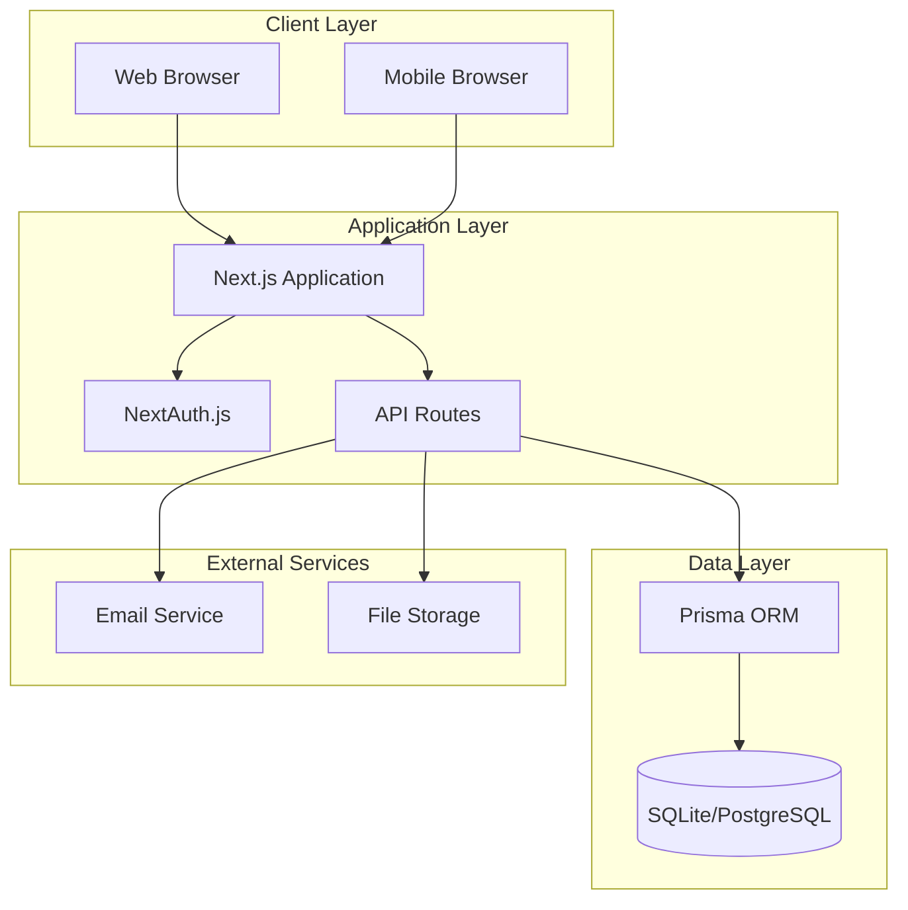
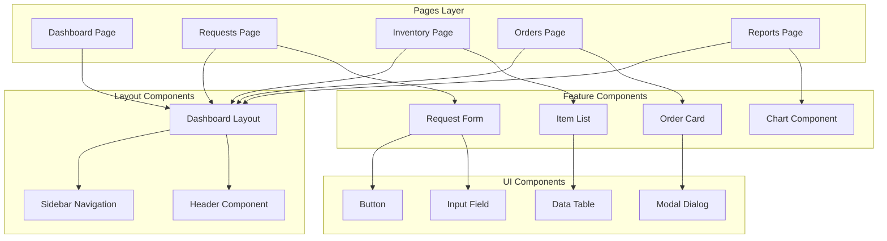
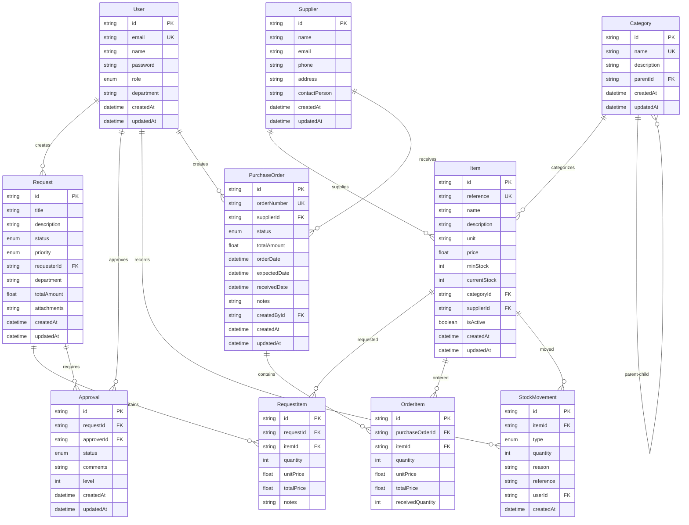
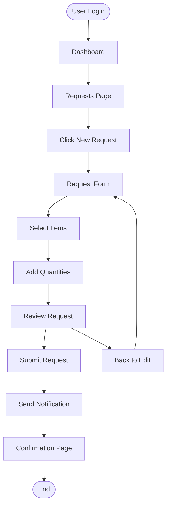
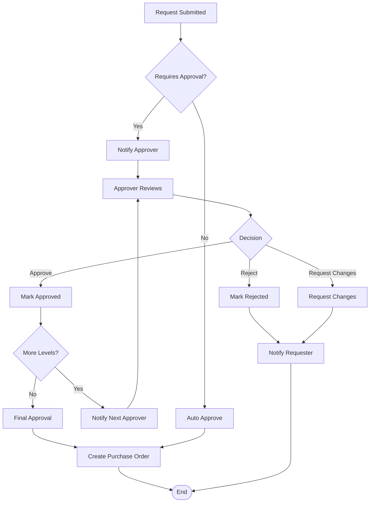
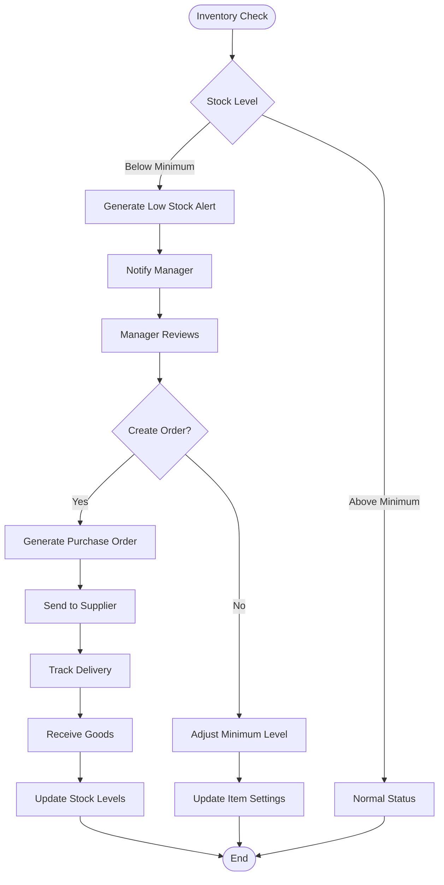
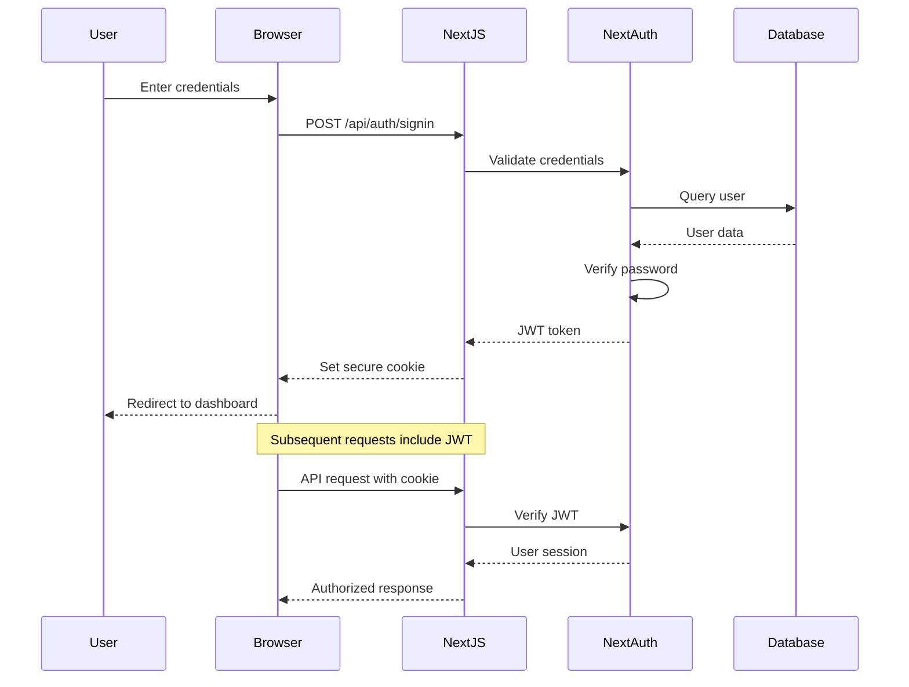
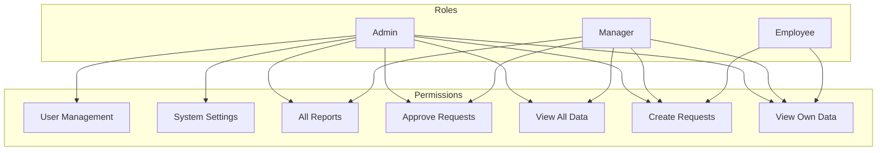
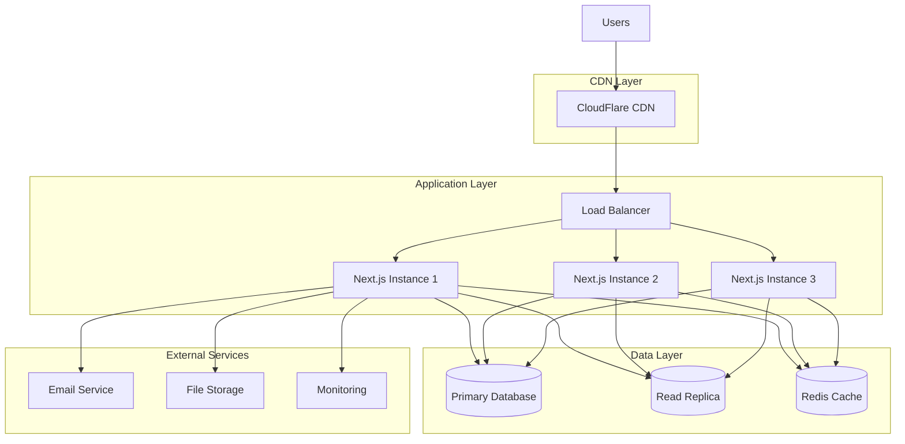
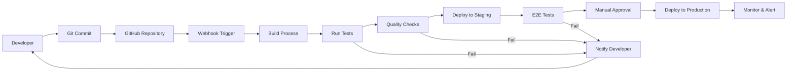

# Architecture Diagrams - Office Supplies Management System

## System Architecture Overview

### High-Level System Architecture

### Component Architecture

## Database Entity Relationship Diagram

## User Flow Diagrams

### Request Creation Flow

### Approval Workflow

### Inventory Management Flow

## Security Architecture

### Authentication Flow

### Authorization Matrix

## Deployment Architecture

### Production Deployment

### CI/CD Pipeline

---

*These diagrams provide a comprehensive visual representation of the system architecture, data relationships, user flows, security model, and deployment strategy for the Office Supplies Management System.*
